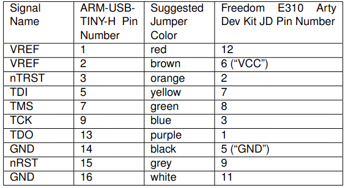
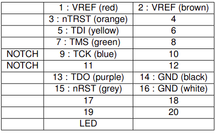
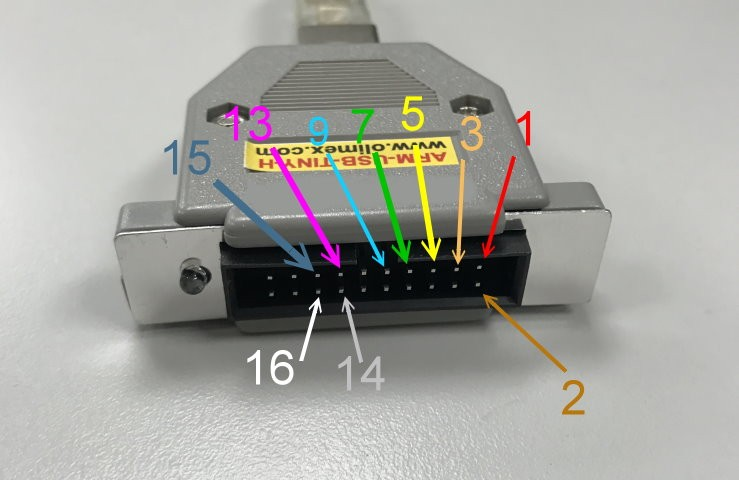
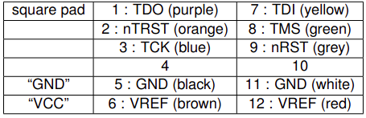
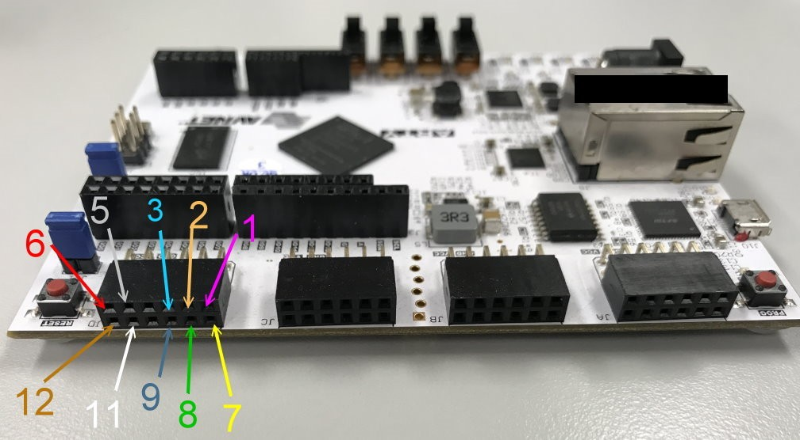
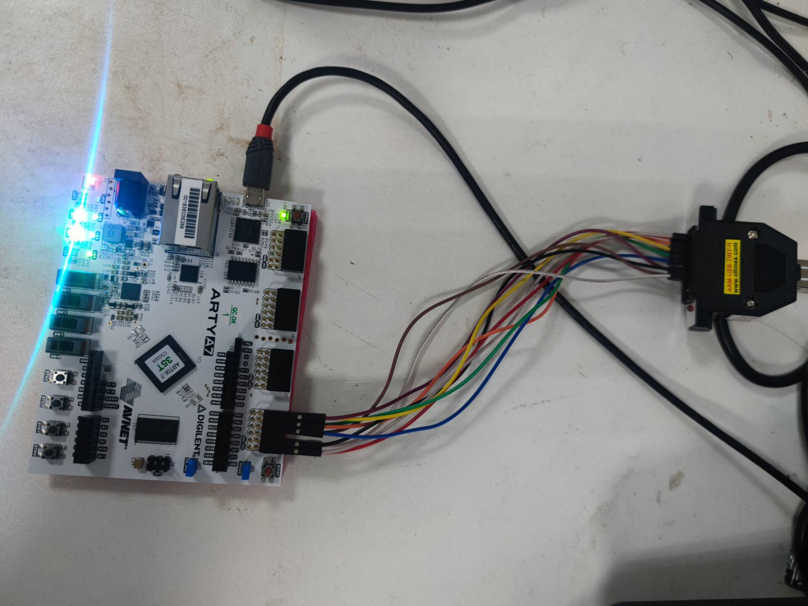

# Required Hardware
#### 1. Xilinx Artix-7 35T Arty FPGA Evaluation Kit
35T与100T同为Digilent Arty A7 主板， 支持RISC-V。35T已停产，100T可提供最稳定和可扩展的选项，两者构建方式类似，但35T存在的用户指南存在问题较多。本文在35T上运行RISC-V。
#### 2. USB A to Micro-B Cable
用来供电，需直接接入主机而非独立电源，不然Vivado无法检测到设备。
#### 3. Olimex ARM-USB-TINY-H Debugger
一种JTAG调试器，Freedom E310 Arty FPGA Dev Kit 有标准JTAG调试接口。
#### 4. USB A to B Cable
用来连接Olimex ARM-USB-TINY-H Debugger和目标主机
#### 5. Male-To-Female Jumper Cables (10)
杜邦线（公转母）


# Board Setup
#### 1. 连接
按上述对应说明将设备连接到主机，开发板和调试器之间的连接如下图：
<div style="text-align: center;">



Fig.1 Debugging Connections between Olimex ARM-USB-TINY-H and Arty Board’s PMOD header JD
</div>
<br>

<div style="text-align: center;">



Fig.2.1 Debug Connections To the Olimex ARM-USB-TINY-H
</div>
<br>

<div style="text-align: center;">



Fig.2.2 Pin number of the Olimex ARM-USB-TINY-H
</div>
<br>

<div style="text-align: center;">



Fig.3.1 Debug Connections to the Arty Board JD PMOD Header
</div>
<br>

<div style="text-align: center;">



Fig.3.2 Pin number of the Arty Board JD PMOD Header
</div>
<br>

<div style="text-align: center;">



Fig.4 Photo of the board showing USB and Debug connections
</div>
图片为实验完成后的照片，首次设置只有电源灯会亮。
<br><br>

# Getting Started
#### 1. Download and install vivado. 
简单的下载安装，不详细介绍了。

#### 2. Download and include board file.
```
git clone https://github.com/Digilent/vivado-boards.git
cp -r vivado-boards/new/board_files/* $Vivado_Path/data/boards/board_files/
```

#### 3. Building the RISC-V
首先，下载SiFive freedom
```
git clone https://github.com/sifive/freedom.git
git submodule update --init --recursive
```
注意，由于一些子模块链接更新，这部分可能会发生错误，对错误的子模块，找到其正确的地址，并将修改对应子模块地址。一些需要更新的子模块如下（不保证完整）：
```
[submodule "dtc"]
	active = true
	url = https://gitlab.com/qemu-project/dtc.git
[submodule "pixman"]
	active = true
	url = https://gitlab.freedesktop.org/pixman/pixman.git
[submodule "roms/SLOF"]
	active = true
	url = https://gitlab.com/qemu-project/SLOF.git
[submodule "roms/ipxe"]
	active = true
	url = https://gitlab.com/qemu-project/ipxe.git
[submodule "roms/openbios"]
	active = true
	url = https://gitlab.com/qemu-project/openbios.git
[submodule "roms/openhackware"]
	active = true
	url = https://gitlab.com/qemu-project/openhackware.git
[submodule "roms/qemu-palcode"]
	active = true
	url = https://gitlab.com/qemu-project/qemu-palcode.git
[submodule "roms/seabios"]
	active = true
	url = https://gitlab.com/qemu-project/seabios.git/
[submodule "roms/sgabios"]
	active = true
	url = https://gitlab.com/qemu-project/sgabios.git
[submodule "roms/u-boot"]
	active = true
	url = https://gitlab.com/qemu-project/u-boot.git
[submodule "roms/vgabios"]
	active = true
	url = https://gitlab.com/qemu-project/vgabios.git/
```

在这个目录中，有几个Makefile。 Arty-a7 35T使用 Makefile.e300artydevkit。如下：
```
# See LICENSE for license details.
base_dir := $(patsubst %/,%,$(dir $(abspath $(lastword $(MAKEFILE_LIST)))))
BUILD_DIR := $(base_dir)/builds/e300artydevkit
FPGA_DIR := $(base_dir)/fpga-shells/xilinx
MODEL := E300ArtyDevKitFPGAChip
PROJECT := sifive.freedom.everywhere.e300artydevkit
export CONFIG_PROJECT := sifive.freedom.everywhere.e300artydevkit
export CONFIG := E300ArtyDevKitConfig
export BOARD := arty
# export BOARD := arty_a7_100
export BOOTROM_DIR := $(base_dir)/bootrom/xip

rocketchip_dir := $(base_dir)/rocket-chip
sifiveblocks_dir := $(base_dir)/sifive-blocks
VSRCS := \
	$(rocketchip_dir)/src/main/resources/vsrc/AsyncResetReg.v \
	$(rocketchip_dir)/src/main/resources/vsrc/plusarg_reader.v \
	$(sifiveblocks_dir)/vsrc/SRLatch.v \
	$(FPGA_DIR)/common/vsrc/PowerOnResetFPGAOnly.v \
	$(BUILD_DIR)/$(CONFIG_PROJECT).$(CONFIG).rom.v \
	$(BUILD_DIR)/$(CONFIG_PROJECT).$(CONFIG).v

include common.mk
```
注意对于Arty-a7 100T，需要将BOARD修改为`arty_a7_100`。

然后，编译MCS文件：
```
make -f Makefile.e300artydevkit Verilog
make -f Makefile.e300artydevkit mcs
```
输出的文件位于： `<workspace>/freedom/builds/e300artydevkit/obj`，包括BIT，MCS等文件。

#### 4. Programming the Hardware
首先，安装Xilinx驱动 :
```
$Vivado_Path/data/xicom/cable_drivers/lin64/install_script/install_drivers
sudo ./install_drivers
```
确认Olimex USB拥有对应权限，`/etc/udev/riles.d/olimex-arm-usb-tiny-h.rules`
增加：
```
SUBSYSTEM=="usb", ACTION=="add", ATTRS{idProduct}=="002a", ATTRS{idVendor}=="15ba", MODE="664", GROUP="plugdev"
```
`/etc/udev/riles.d/99-openocd.rules`
增加：
```
SUBSYSTEM=="usb", ATTR{idVendor}=="0403", ATTR{idProduct}=="6010", MODE="664", GROUP="plugdev"
SUBSYSTEM=="tty", ATTRS{idVendor}=="0403", ATTRS{idProduct}=="6010", MODE="664", GROUP="plugdev"

SUBSYSTEM=="usb", ATTR{idVendor}=="15ba", ATTR{idProduct}=="002a", MODE="664", GROUP="plugdev"
SUBSYSTEM=="tty", ATTRS{idVendor}=="15ba", ATTRS{idProduct}=="002a", MODE="664", GROUP="plugdev"
```
然后，`usermod -a -G plugdev $whoami` 将当前用户新增为plugdev的成员。

检查调试器连接和串口设备：
```
    > lsusb
    ...
    Bus 001 Device 047: ID 0403:6010 Future Technology Devices International, Ltd FT2232C/D/H Dual UART/FIFO IC

    > ls /dev/ttyUSB*
    /dev/ttyUSB0  /dev/ttyUSB1
```
（不一定是USB1）

打开Vivado图形界面，*Open Target* -> *Auto Connect*, 只要板子与主机正确连接，Vivado将自动检测到对应的FPGA。 选中对应设备，右击，选择 *Add Configuration Memory Device*, 选择**s25fl128sxxxxxx0-spi-x1_x2_x4**, 然后选择上面生成的MCS文件，点击OK，按一下板子左上角的proc按钮或者在vivado中启动板子，然后板子就运行了对应的RISC-V处理器。

如何确认处理器正确运行：

    1. 按按钮3，LED 6闪烁。
    2. 按reset按钮，LED 4闪烁。
   
# Generation Software
官方有推荐使用Arduino开发环境，但是此IDE不支持35T，不知道能不能支持100T，没有尝试。所以我们使用`freedom-e-sdk`来生成并上传用户软件,由于新版不支持35T,我们使用Commit ID : `4d5cbec9118cbedf2d4ae5b54acaa22862245a4c`的版本。

首先：
```
git clone https://github.com/sifive/freedom-e-sdk.git
git checkout 4d5cbec9118cbedf2d4ae5b54acaa22862245a4c
git submodule update --init --recursive
make tools
```
然后，修改`bsp/env/freedom-e300-arty/openocd.cfg`第16行去掉`-expected-id`, 22行末尾增加`0x10014000`, 修改后如下：
```
adapter_khz     10000

#source [find interface/ftdi/olimex-arm-usb-tiny-h.cfg]

interface ftdi
ftdi_device_desc "Olimex OpenOCD JTAG ARM-USB-TINY-H"
ftdi_vid_pid 0x15ba 0x002a

ftdi_layout_init 0x0808 0x0a1b
ftdi_layout_signal nSRST -oe 0x0200
ftdi_layout_signal nTRST -data 0x0100 -oe 0x0100
ftdi_layout_signal LED -data 0x0800
#

set _CHIPNAME riscv
# jtag newtap $_CHIPNAME cpu -irlen 5 -expected-id 0x10e31913
jtag newtap $_CHIPNAME cpu -irlen 5

set _TARGETNAME $_CHIPNAME.cpu
target create $_TARGETNAME riscv -chain-position $_TARGETNAME
$_TARGETNAME configure -work-area-phys 0x80000000 -work-area-size 10000 -work-area-backup 1

flash bank my_first_flash fespi 0x20000000 0 0 0 $_TARGETNAME 0x10014000

init
#reset
if {[ info exists pulse_srst]} {
  ftdi_set_signal nSRST 0
  ftdi_set_signal nSRST z
}
halt
# flash protect 0 64 last off
```
主机上打开一个终端，`screen /dev/ttyUSB2 57600`来监听对应串口输出。然后执行：
```
make software PROGRAM=hello BOARD=freedom-e300-arty
make upload PROGRAM=hello BOARD=freedom-e300-arty
```
在监听端口看到输出 **hello world!** 即成功。如输出乱码，尝试修改监听的波特率。
如报错：
```
Info : Padding image section 0 with 2 bytes
Info : Padding image section 1 with 2 bytes
riscv.cpu: target state: halted
Error: PC ended up at 0x80000000 instead of 0x80000004
Error: Failed to execute algorithm at 0x80000000: -4
Error: error writing to flash at address 0x20000000 at offset 0x00400000
```
请尝试升级openocd版本。


# Reference
https://sifive.cdn.prismic.io/sifive%2Fed96de35-065f-474c-a432-9f6a364af9c8_sifive-e310-arty-gettingstarted-v1.0.6.pdf

https://digilent.com/reference/programmable-logic/arty-a7/arty_a7_100_risc_v/start

https://ithelp.ithome.com.tw/articles/10196583

https://forums.sifive.com/t/unable-to-execute-program-in-freedom-e300/6231

